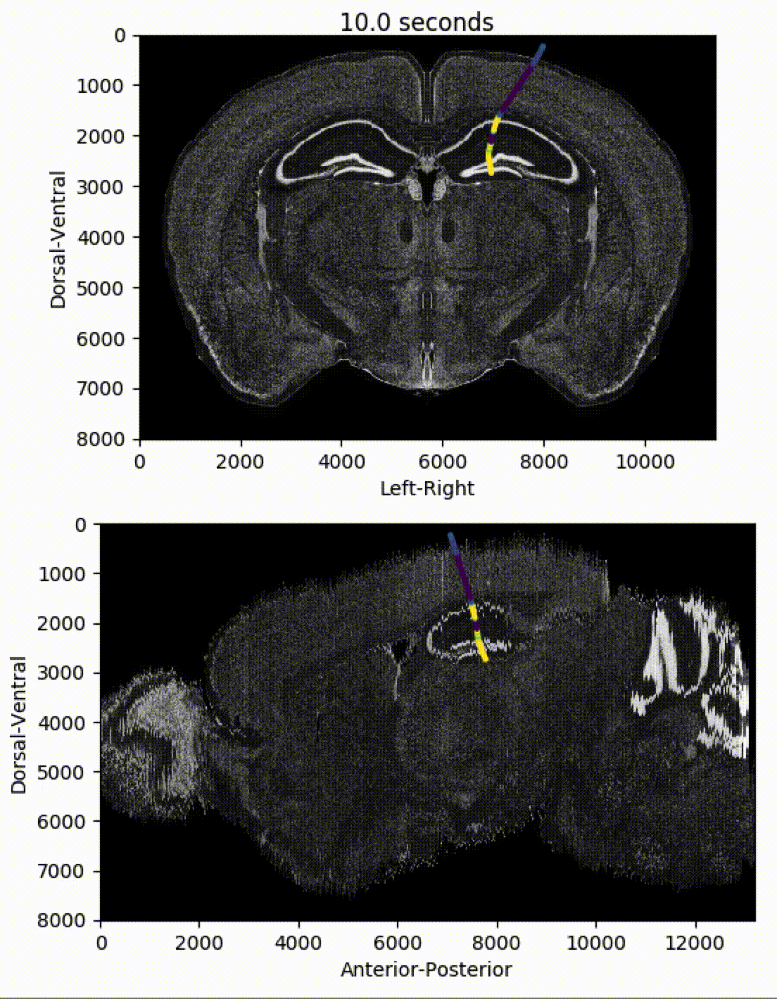
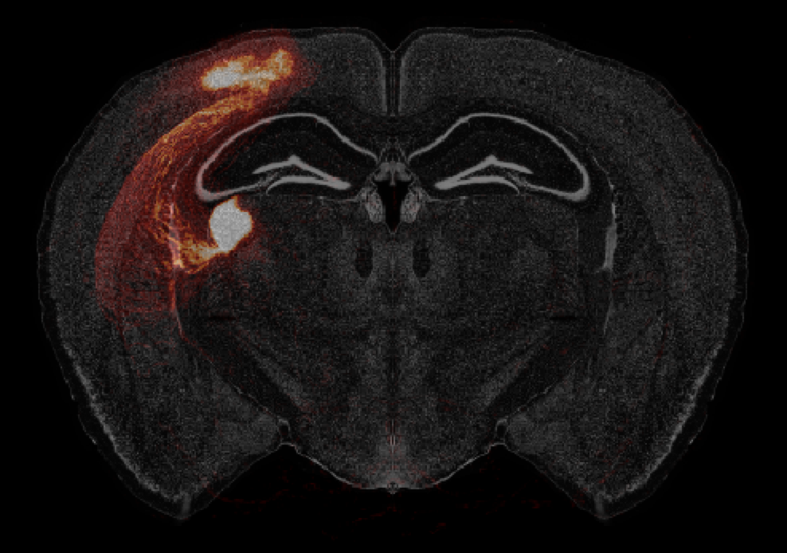

# Code to visualise and analyse Allen Institute data

Data taken from the Visual Coding - Neuropixels <a href="https://portal.brain-map.org/explore/circuits/visual-coding-neuropixels">dataset</a>

## Visualising data from a single Neuropixels probe

<a href="https://github.com/michaelsmclayton/ComputationalNeuroscienceTools/blob/master/AllenInstitute/NeuroPixels/neuropixelsLFP.py">neuropixelsLFP.py</a>

<a href="https://github.com/michaelsmclayton/ComputationalNeuroscienceTools/blob/master/AllenInstitute/NeuroPixels/mouseConnectivity.py">mouseConnectivity.py</a>

## Visualising mouse connectivity data

Maximum projection density - connectivity from lateral geniculate nucleus (LGN)