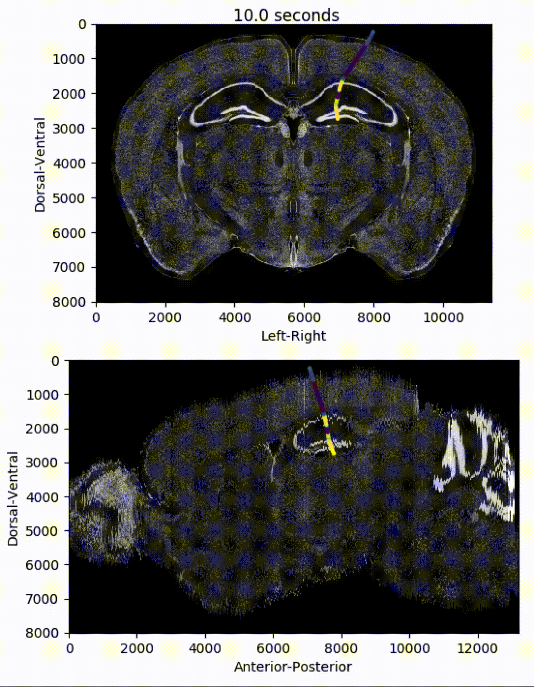

# Visualising data from a Neuropixels probe (Allen Institute)

Data taken from the Visual Coding - Neuropixels <a href="https://portal.brain-map.org/explore/circuits/visual-coding-neuropixels">dataset</a>

<a href="https://github.com/michaelsmclayton/ComputationalNeuroscienceTools/blob/master/AllenInstitute/NeuroPixels/neuropixels.py">neuropixels.py</a>

