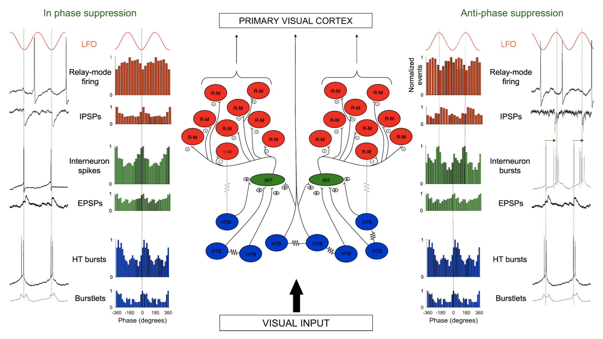
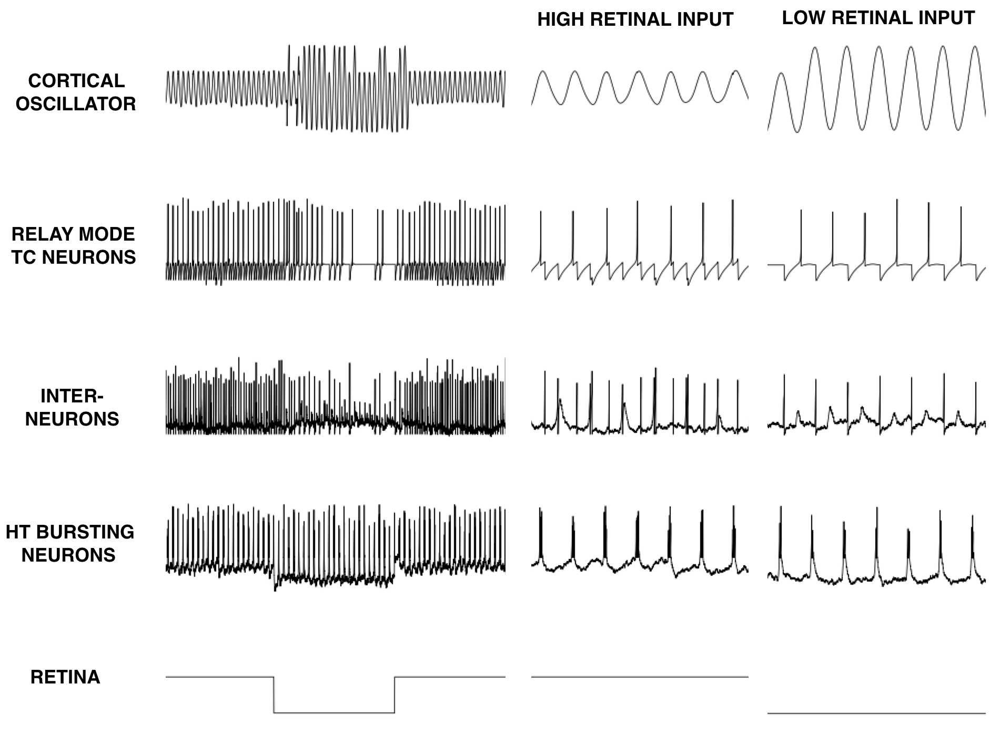

# In-silico model of the contribution of the thalamus to cortical alpha power
Inspired by data collected by data collected in: 
<i>Lőrincz, M. L., Kékesi, K. A., Juhász, G., Crunelli, V., & Hughes, S. W. (2009). Temporal framing of thalamic relay-mode firing by phasic inhibition during the alpha rhythm. Neuron, 63(5), 683-696</i>

## Original model

## Output of current, computational model
