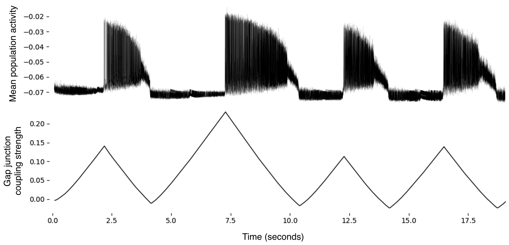

# Brian 2 implementation of <i>Gap junction plasticity as a mechanism to regulate network-wide oscillations</i>

See <a href="https://journals.plos.org/ploscompbiol/article?id=10.1371/journal.pcbi.1006025">link</a> for original paper

### Emergence of periodic synchroncity in firing

<a href="https://github.com/michaelsmclayton/ComputationalNeuroscienceTools/tree/master/Brian/code/examples/gapJunctions/periodicSynchronicity.py">periodicSynchronicity.py</a> 

Here, a population of inhibitory neurons is connected to itself with electrical synapses (i.e. gap junctions). The strength of these gap junctions are plastic, such that when neurons fire at high rates, their connections decrease in strength, while these connections increase in strength during periods of reduced firing rates. We see in this figure that such increases and decreases in gap junction strength over time leads to the periodic emergence of synchronous, bursting activity.