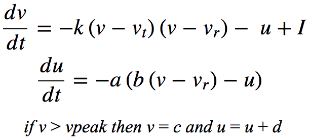
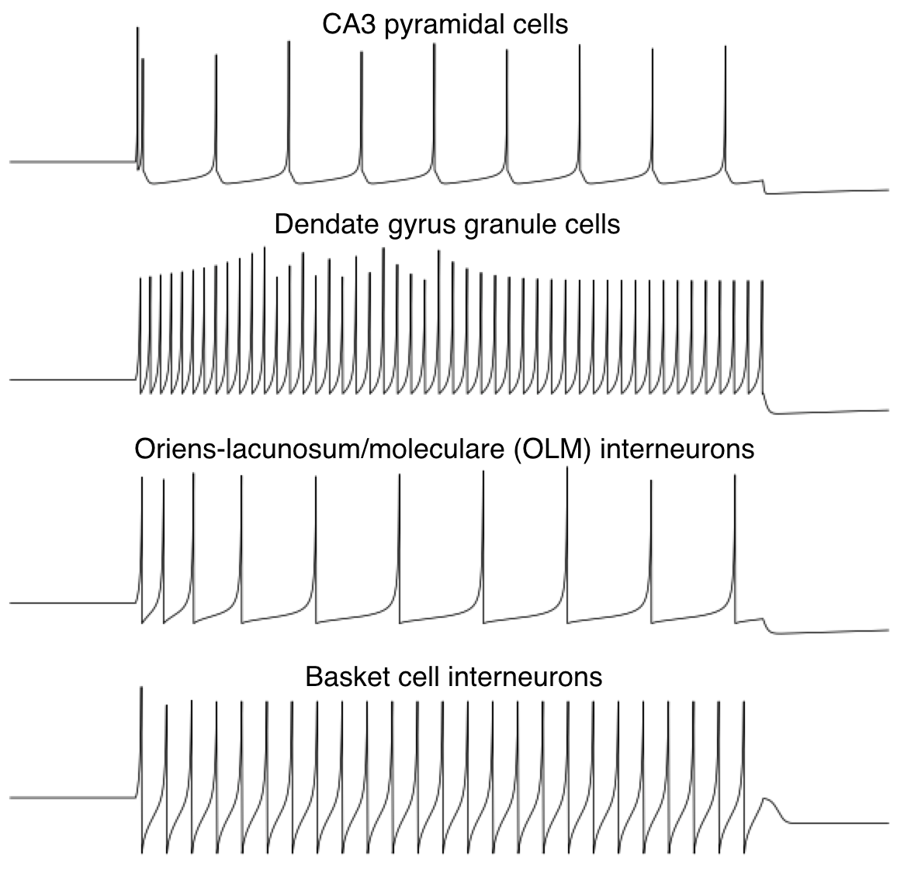

# Brian 2 implementation of <i>An integrative model of the intrinsic hippocampal theta rhythm</i> (Hummos & Nair, 2017; PLoS One)

See <a href="https://journals.plos.org/plosone/article?id=10.1371/journal.pone.0182648">link</a> for original paper

### Spiking neural model of an Izhikevich formulation

### Neuron types

Parameters 
- CA3 pyramidal C = 24; k = 1.5; a = .010; b = 2; c = -63; d = 60; vThresh = -75; vRest = -58; vPeak = 29 
- Dendate gyrus granule cells C = 24; k = 1.0; a = .015; b = 3; c = -62; d = 3; vThresh = -73; vRest = -53; vPeak = 32 
- Oriens-lacunosum/moleculare (OLM) interneurons C = 80; k = 1.5; a = .003; b = 10; c = -65; d = 30; vThresh = -68; vRest = -53; vPeak = 30 
- Basket cell interneurons C = 16; k = 1.5; a = .900; b = 2; c = -80; d = 400; vThresh = -65; vRest = -50; vPeak = 28 