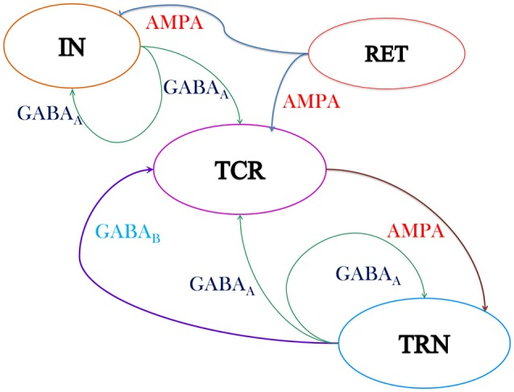
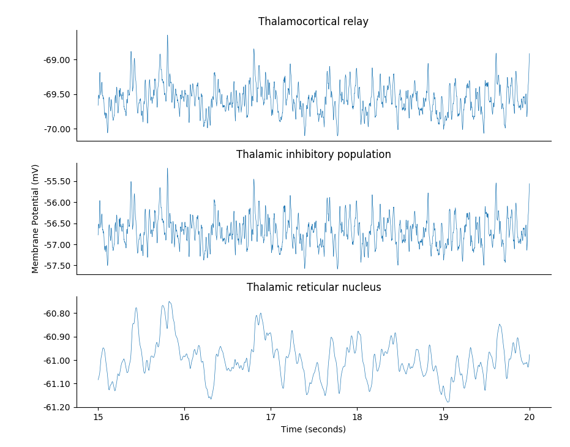

## A Brian 2 implementation of <i>Causal Role of Thalamic Interneurons in Brain State Transitions: A Study Using a Neural Mass Model Implementing Synaptic Kinetics</i>

 
Schematic of the neural mass model of the thalamic Lateral Geniculate Nucleus (LGN) consisting of: 
- the Thalamocortical Relay (TCR) 
- the Interneurons (IN) 
- the Thalamic Reticular Nucleus (TRN)

 
LFP activity generated by the model