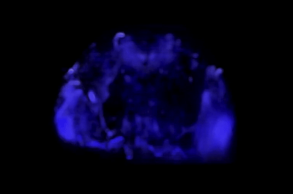

# Visualising evoked brain activity in Drosophila, following visual and odor stimuli

Data taken from: 
Fast near-whole brain imaging in adult Drosophila during responses to stimuli and behavior. Sophie Aimon, Takeo Katsuki, Tongqiu Jia, Logan Grosenick, Michael Broxton, Karl Deisseroth, Terrence J. Sejnowski, Ralph J Greenspan  bioRxiv 033803; doi: https://doi.org/10.1101/033803"
 
https://portal.nersc.gov/project/crcns/download/fly-1 
https://github.com/sophie63/FlyLFM 

### Spatial structure of visually evoked activity

 

### Visual stimuli
 

### Odor stimuli 
 

Note that data is maximum projection activity, averaged over many trials