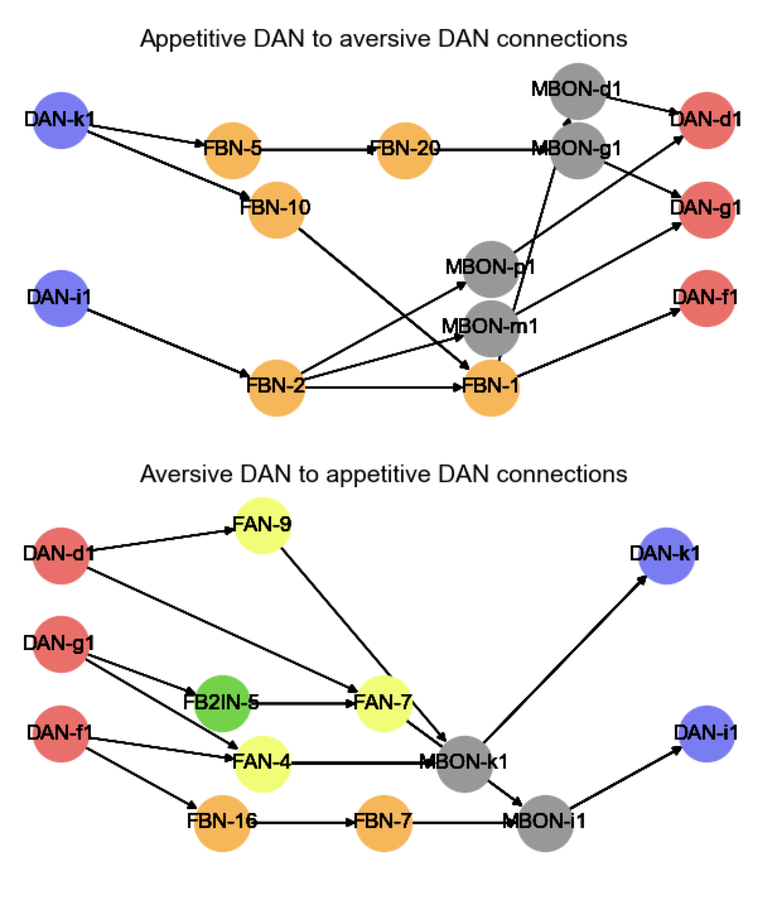

From data published in: 
<a href="">Eschbach, C., Fushiki, A., Winding, M., Schneider-Mizell, C. M., Shao, M., Arruda, R., ... & Gerber, B. (2020). Recurrent architecture for adaptive regulation of learning in the insect brain. Nature Neuroscience, 23(4), 544-555</a>

## Analysing shortest path connections between DAN conveying appetitive and aversive information

     
        produced by <a href="https://github.com/michaelsmclayton/ComputationalNeuroscienceTools/blob/master/FruitFly/recurrentMushroomBodyNetwork/graphAnalyses/rossValenceConnections.py">crossValenceConnections.py</a>  
    <b>Shortest path connections between appetitive and aversive DANs</b>. This figure shows the shortest paths between DANs conveying appetitive (blue) and aversive (red) information. For connections from appetitive to aversive DANs (top panel), links occur principally through feedback neurons (FBNs) that project to MBONs and DANs in the vertical lobe and lateral appendix, as well as multi-compartmental MBONs. In contrast, connections from aversive to appetitive DANs (bottom panel) travel through feed-across neurons (FANs), which then project straight to MBONs and DANs in the medial lobe. Note that this graph shows only the shortest paths between these neurons, and does not describe all possible routes. Connections from appetitive DAN-h1 were excluded as no post-synaptic partners for this neuron were found. 

