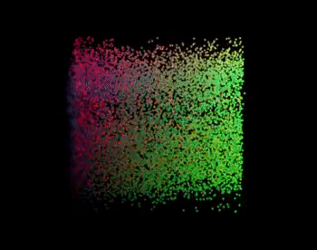

# Neuroscience Data Challenge (Dataset 3)

These scripts have been tested using a 2018 MacBook Pro (OS X 10.13.4)

## Download data
 - Before running scripts, download the required data using <a href="https://github.com/michaelsmclayton/ComputationalNeuroscienceTools/blob/master/Janelia/StringerEtAl2019/downloadData.py">downloadData.py</a> (requires wget)

## Visualising the imaged neurons

     
    <a href="https://github.com/michaelsmclayton/ComputationalNeuroscienceTools/blob/master/Janelia/StringerEtAl2019/visualiseNeurons.py">visualiseNeurons.py</a>

## Assess neural correlations across image categories

     
    <a href="https://github.com/michaelsmclayton/ComputationalNeuroscienceTools/blob/master/Janelia/StringerEtAl2019/correlationsAcrossCategories.m">correlationsAcrossCategories.m</a>

