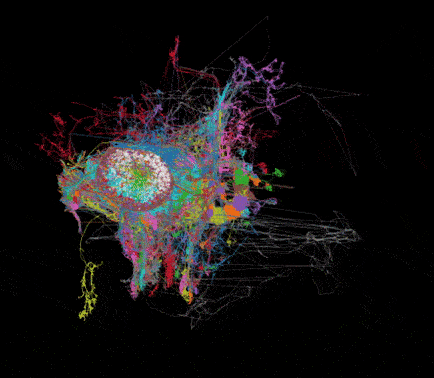

# Visualising Drosophila neural anatomy using <i>neuprint</i>

<a href="https://github.com/michaelsmclayton/ComputationalNeuroscienceTools/blob/master/Janelia/neuprint/code/regionVisualisation.py">regionVisualisation.py</a>

### Projections from fan-shaped body to the ellipsoid body (located in the central complex)
 

### Kenyon cells (located in mushroom bodies)  
 