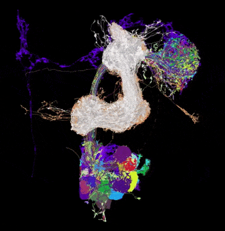

# Visualising Drosophila neural anatomy using <i>neuprint</i>

<a href="https://github.com/michaelsmclayton/ComputationalNeuroscienceTools/blob/master/Janelia/neuprint/code/regionVisualisation.py">regionVisualisation.py</a>

 
Projections from fan-shaped body to the ellipsoid body (located in the central complex)

 
Olfactory projections from the antennal lobe (Kenyon cells shown in white)  

 
Kenyon cells (located in mushroom bodies)  

